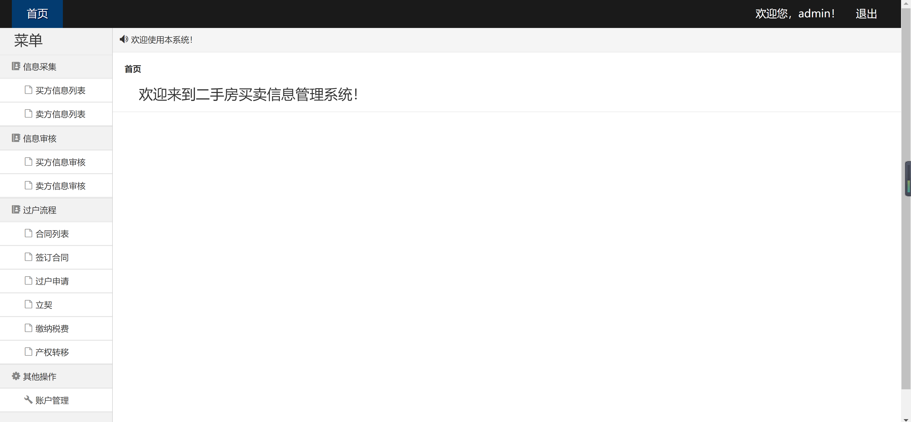
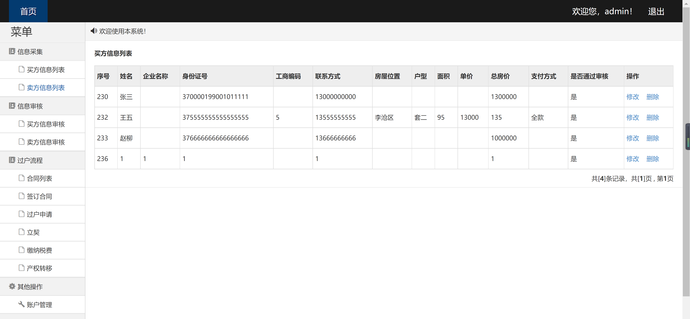
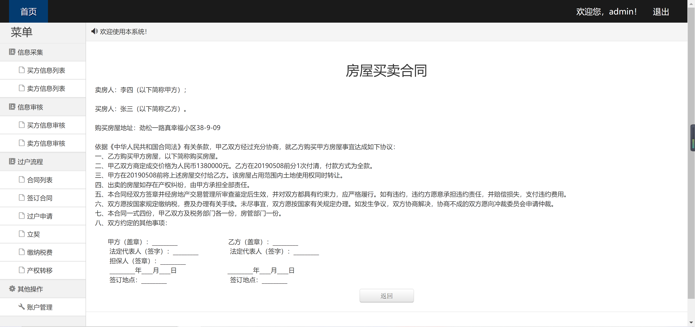
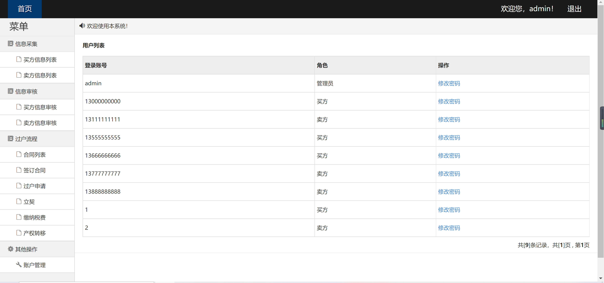

<h1 align="center">二手房买卖信息管理系统</h1>

## 简介
二手房买卖信息管理系统：角色分为管理员、业务员、卖方、买方；功能包括信息采集、信息审核、过户流程管理、合同签署与管理。    --计算机毕业设计源码；毕设源码；java毕业设计源码

## 联系方式

<h3 align="center">获取完整代码与数据库文件 + 微信：bysj5151 QQ: 86050149 QQ群: 783742310</h3>

<h3 align="center">可帮忙远程部署 包运行成功！提供远程部署、修改代码、设计文档指导、代码讲解等服务！</h3>

## 功能介绍（完整见运行截图）
管理员：提供信息采集、信息审核、合同流程、用户申请和账户管理等功能模块，能够查看、修改、审核二手房信息和用户数据，进行合同签订、缴纳税费及产权转移等操作，并管理用户角色与权限。买方：可通过用户界面搜索、查看和对比房源信息，利用过滤选项按价格、位置和房型等条件筛选结果，查看房屋详细信息及卖方联系方式，与卖方达成交易协议，并申请合同签署和后续手续办理。卖方：查看和管理自己的房源信息列表，修改或删除房产信息，确保信息真实可靠，提交卖方信息进行系统审核，参与合同签署，处理交易流程中的过户和税费缴纳事宜。业务员：协助信息采集和审核，支持买方与卖方的信息匹配与交流，促进交易达成，负责合同签署与流程跟进，确保交易的合法性和顺利进行，提供技术支持与操作指导。

## 运行截图

本代码来源于网络,仅供学习参考使用!

